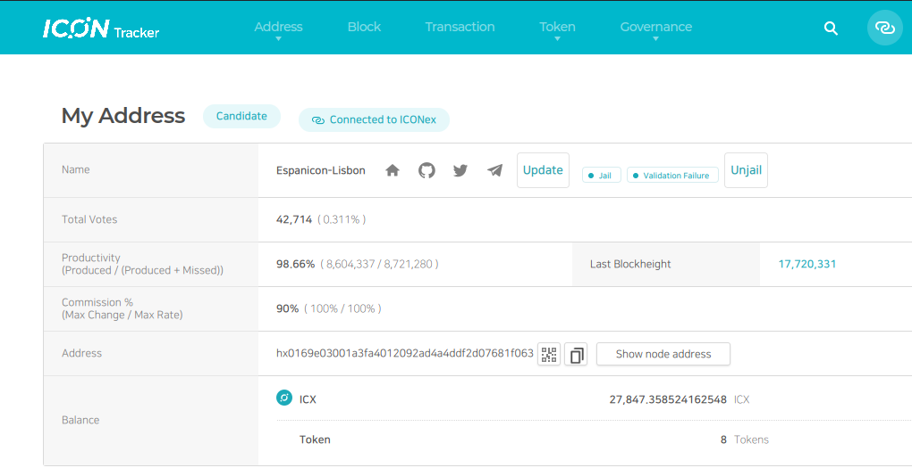
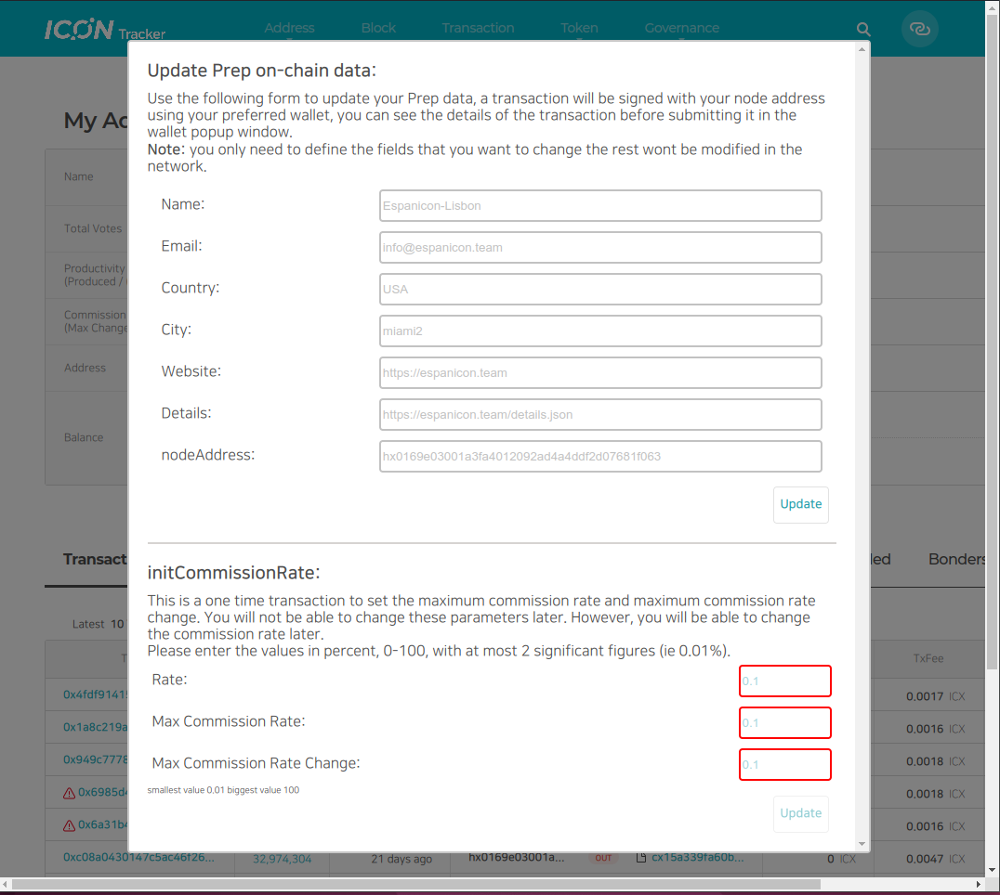
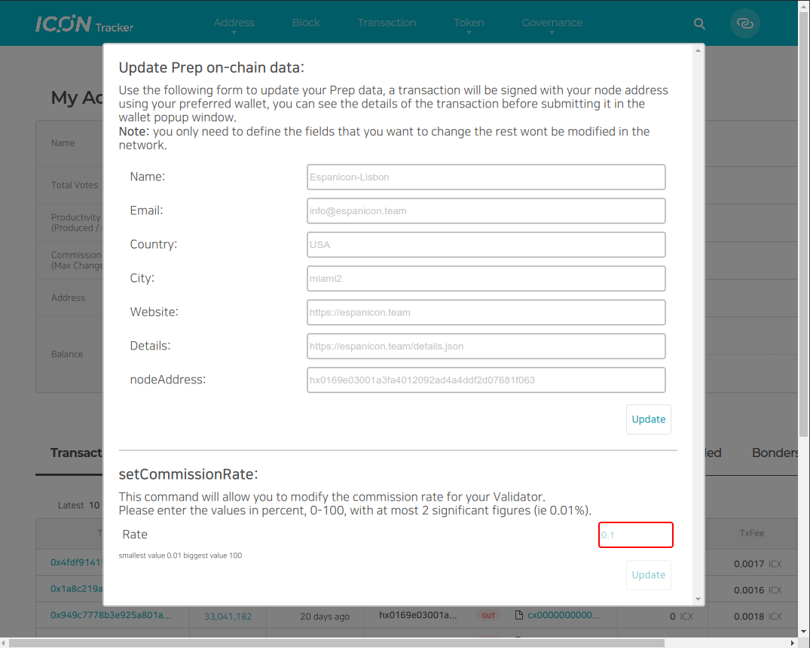

The update for the ICON Economic Policy 4.0 (IISS 4.0) has introduced two new features into the governance system for validators which are Commission Rates to distribute inflation to your stakers/voters and a new state in validators operations which is the possibility of being send to Jail if the node doesnt produce blocks.

The community tracker has been updated to give the validators an easy way of executing these governance calls, in order to be able to access them first login with your validator wallet in the tracker and then go to your validator address page.

You now will be able to see an "Update" button right next to your validator name to open up a pop up window that will allow you to set the Commission Rate parameters.

## initCommissionRate and setCommissionRate

If this is the first time you try to set the Commission Rate for your validator, once you click on the "Update" button the pop up window will show you at the bottom a form that will allow you to set up the parameters for the transaction call to execute the `initCommissionRate` function.

Fill the respective parameters and then click on "Update" button at the bottom to sign the transaction.

Once you have signed the `initCommissionRate` transaction once, you can modify the Commission Rate by entering the same pop up window, in this case the window will show you a new form that will allow you to sign a transaction to call the `setCommissionRate` method of the chain network contract.

## Unjail

If your validator is unable to validate blocks it will be send to "jail" in the network, this means that your validator will be set up in a state on which you and your stakers/voters will stop earning rewards until you sign a transaction to move the validator out of jail and are once again selected to validate blocks and is able to at least validate one block in the network.

To sign the "Unjail" transaction you can use the "Unjail" button that will be available in your validator address page, next to your validator node name.

