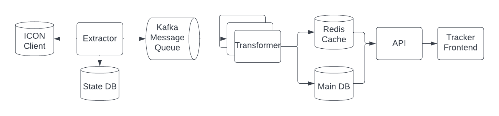

## Indexing for the ICON Blockchain  

Hello ICON community, Rob here from sudoblock to give a technical overview of how we index ICON Blockchain data and make it available to sites like [tracker.icon.community](https://tracker.icon.community/).  We’ll go through how the data gets extracted from the chain, transformed into usable data, and then get into a little bit about how we expose it to users with our infrastructure setup. This article should be digestible to non-technical users with minimal understanding of how the internet works, glossing over details that might be confusing to non-developers.  

In ICON, we have open sourced all the code for the tracker including the indexer which can be found at [github.com/sudoblockio/icon-tracker](github.com/sudoblockio/icon-tracker) which has links down to the individual repositories used to deploy the whole stack. This article will stay high level but should be a good primer for those trying to understand how the whole system works.  

Before getting into the technicalities, let’s take a moment to talk about why we need to index data from blockchains. Blockchains are great datastores for inserting / getting individual data records but because of the internals of how blockchains work, you cannot retrieve multiple records at a time, sort things, or filter them, operations common to a more traditional database. So in order to see things like your transaction history, you need an indexer to extract data out of the chain and put it into a traditional database that is able to perform the query operations that are not possible directly from the chain. 

To build an indexer, there are three main parts, an extractor to take the data out of the chain, a transformer to change the shape of the data into usable objects, and a presentation layer such as an API to expose the data to the user. For the rest of this article we’ll be talking about these three parts and then wrap it up with a little bit of explanation about how our stack works on an infrastructure level.

### Extractor 

The [extractor](https://github.com/sudoblockio/icon-extractor) is the first component in the pipeline that takes the data out of the chain and passes it along to the transformer. There are two main ways to extract data out of the chain, directly from the blockchain by reading files or via remote procedure calls (RPC). Reading files directly from disk is the fastest way to get data out of the chain but requires in depth knowledge of how the chain’s data is stored which could change over time. For this reason, we and the **vast majority** of the indexers in the blockchain space don’t do this. Instead we extract data out via RPC which are basically web requests to the blockchain node. This also allows other users to more easily adopt the stack as it does not require running your own node. 

There are two main RPC calls that we need to make that deliver virtually all the data we need about the blockchain, [icx_getBlockByHeight](https://docs.icon.community/icon-stack/client-apis/json-rpc-api/v3#icx_getblockbyheight) and [icx_getTransactionResult](https://docs.icon.community/icon-stack/client-apis/json-rpc-api/v3#icx_gettransactionresult). The icx_getBlockByHeight call gets all the metadata about the block and a list of all the transactions that happened within the block. From that list, we then need to iterate through all the transactions and call icx_getTransactionResult on each one to find the logs from the transaction. This is where we find data such as token transfers and internal transactions but it will need further processing as described in the next section for the transformer. 

Before sending this data down to the transformer we need to package it up into a data structure that can be easily processed. There are a lot of different ways to do this but for us, we use a format called protobuf which are compact binary messages first invented by Google and are the main message format they use across all their internal systems. You can see the actual file [here](https://github.com/sudoblockio/icon-transformer/blob/main/src/schemas/block_etl.proto) but as a brief summary, each block is a single message that has a collection of transactions with each transaction having a collection of logs. This block message is then passed down into a transformer through a message queue (kafka) and can be replayed in case additional data points / indexes need to be created. 

Getting the data out of the chain can be a time-consuming / computationally expensive task. In order to parallelize it, we have built a sort of internal task queue which breaks up a block range into chunks and allows for multiple extractors to operate on a block range at the same time.  Once the historical has been indexed over a given block range, we run another instance of the extractor which polls an ICON node waiting for new blocks to be produced to get the latest data into the system. 

### Transformer 

Once the primitive block data has been extracted, we then need to normalize the data with [a transformer](https://github.com/sudoblockio/icon-transformer) into usable tables. Things like blocks, transactions, logs are easily extracted out of the base schema from the extractor but other data items such as addresses, tokens, token transfers, and others need to be enriched before loading into a database. Each one of these data items requires customized logic so it is worth going into some details about how each one of the indexes are built. 

##### Addresses 

Every address that exists within the ICON network is tracked. To do this, whenever we see a transaction or token transfer, we check and see if the address is new. Once we discover a new address, we add that to an addresses table.  Once it is loaded, we track some metadata associated with it such as if it is a contract / token, a p-rep, and other dynamic stats such as its transaction / token transfer count and balance. When we are processing historical data, it is too computationally intensive to compute dynamic stats on each new address so we have toggles for these types of processing regimes so that only when we are at head (the latest block) do we update these values. We also have batch processes that run on a timer that update some of these dynamic stats so we can make sure the data is up to date. 

##### Contracts and Tokens 

Similar to addresses, every time a new contract is created on the blockchain we extract data about it to determine what type of contract it is, specifically if it is a token or not. There are several token standards on the ICON network including IRC2 for fungible tokens and IRC3 / IRC31 for non-fungible tokens. To determine if a contract is a token and what type of token it is, we make an RPC call [icx_getScoreApi](https://docs.icon.community/icon-stack/client-apis/json-rpc-api/v3#icx_getscoreapi) with the contract’s address to get the contract’s ABI (application binary interface) which is basically a list of different methods and fields that are exposed by a contract. You can see this ABI when you go to the “Read Contract” tab for a contract. Token standards have a predefined list of different methods that must be implemented so we compare these token standard methods with the ABI to see if the contract has implemented them all and thus classify the contract with a token standard. Additionally, we can make another RPC call getScoreStatus that pulls data such as the contract owner, the origination Tx hash (when it was created), and other details such as its status. 

##### Token Transfers 

Token transfers occur through transactions but the details of a token transfer are buried within the logs of that transaction. As we just outlined, tokens implement a predefined set of methods with the most important being the “Transfer” method that allows token transfers to occur. It is up to the contract creator to implement the semantics of how a token transfer takes place but from our perspective when indexing, we just care about the arguments that were used when calling the method and the associated event log that was emitted when the transfer event happened. So to index these token transfer events, we look through all the logs, see if there was a “Transfer” event, determine the function signature of the event (basically the arguments that were used to call the contract), and based on those arguments pull out the from address, to address, and amount for fungible (IRC2) or NFT ID for non-fungible contracts (IRC3 + IRC31) for inserting that data into a database. There are a few more details going on with this process but from a high level, this is how token transfers are recorded on the chain. 

### Presentation Layer 

Once the data has been extracted, transformed, and loaded into tables, we then need to expose that data over APIs so that frontends can fetch that data and display it to the user. To support the tracker, we use two different types of APIs, REST APIs which are basically URLs with query parameters and websockets which streams data live over a connection. The REST APIs drive the majority of the tables that you see in the tracker where as the websockets are responsible for updating tables like the ones you see on the landing page of the tracker where records are updated as they come in. 

For almost all the queries, we have a redis cache sitting in front of the DB to allow the quick fetching of expensive queries allowing much faster response times. The most common of these cached data items is the total count of records for the query which is returned in a header “x-total-count”. This allows users of the API to know the total number of records returned from a query so that when you have buttons on the bottom right of a table in the tracker, you know how many pages of data can be returned. If we didn’t have the cache, each time we had to hit a query we’d additionally need to count the total number of items in the database which ends up taking up to 100x more time than the actual query itself.  

The REST API is also documented through a spec called OpenAPI, formerly known as Swagger, and allows the creation of documents that show exactly which query parameters are available when using the API. We have a couple different services that in the backend, one for the main endpoints, another for contracts, and a third for governance. Each one is documented with OpenAPI specs which users have found very helpful when building their own frontends for Dapps and other community tools.  These specs are automatically updated as soon as changes happen to the API so they are always up to date. 

### Infrastructure

And last, before wrapping up the article, it is worth noting the infrastructure that the stack runs on.  To get the whole stack working requires upwards of 6 individual services not including databases which then add another 3 components (kafka, postgres, and redis).  Adding in all the ICON nodes that need to be run to serve the main API endpoints and a full observability suite, the stack becomes quite complicated to manage unless care is taken. Further, the tracker is run in multiple regions and for each of the networks (mainnet, sejong, lisbon, and berlin) so it needs to be easily replicated with different parameters depending on where exactly it is being run. 

To make this work, we define all of our infrastructure as code and run it in a clustered environment with a tool called kubernetes, the open source version of the cluster scheduler Google uses to manage their whole backend. Each service / database / resources has at least one configuration file that needs to be filled out perfectly for it to work properly which all told amounts to about 700 files. Most of these files are replicas since we have multiple regions and 4 networks so to manage this properly, we code generate the vast majority of them with a language sudoblock developed called [tackle](https://github.com/sudoblockio/tackle). This allows us to create mini command line interfaces that take templates and render them with values supplied from a high level configuration file and predictably apply them to the target cluster / environment. Managing these configuration files is a very error prone / tedious process but with tackle, it is simple once you get the pattern down. 

Unfortunately for the time being, the infrastructure is closed source due but over time, we will be working towards opening it up.  Managing kubernetes clusters is a very specialized skill set and thus the value of open sourcing the code is quite low. But if you are interested in running your own version of the indexer / tracker, we encourage you to check out the [icon-tracker](https://github.com/sudoblockio/icon-tracker) repository which has a smaller version that you can more easily run with docker-compose, the same way ICON nodes are run. It works fine for testnets but for mainnet it takes a while to sync. It also does not come with a lot of features we rely on to develop the indexer such as continuous integration and observability tools so it is not considered something reliable enough to run the main tracker through. 

### Summary

We hope you learned a bit about how indexing works on the ICON blockchain through this article. While we tried to keep it high level, we did cover some of the most important points to understand how it all comes together.  If you are interested in learning more, feel free to get in touch with Rob from sudoblock through the ICON discord server or telegram dev channel.  Work is constantly happening to improve items both in the frontend and back so if you have any suggestions, please feel free to leave a github issue in the appropriate repository or just simply in the [icon-tracker](https://github.com/sudoblockio/icon-tracker) repo.  
