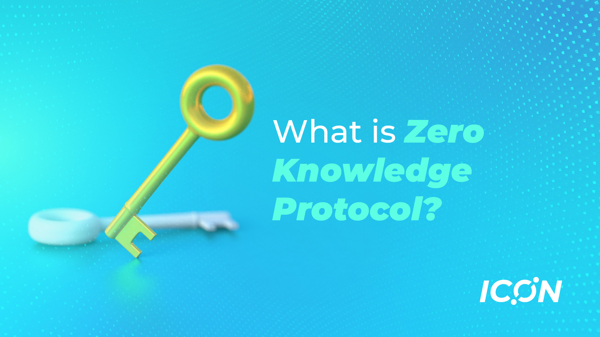

## Year At a Glance
2022 was without a doubt a defining year for cryptocurrencies and other crypto assets. As the “crypto winter” engulfed the space, the price plummeted and valuations plunged causing several high-profile crypto bankruptcies. The year was also marked by several high profile hacks in the crypto space, with cybercriminals [stealing over $3 billion, with $718 million stolen in October 2022 alone](https://fortune.com/crypto/2022/12/30/5-biggest-crypto-hacks-2022/). The [chart below from Bloomberg](https://www.bloomberg.com/graphics/2022-crypto-contagion-from-bitcoin-to-FTX/) shows the timeline of the major crypto events together with the market capitalization.

## ZK in 2022
But 2022 was also a busy year for the whole industry including Ethereum’s merge and Bitcoin’s Taproot Upgrade. It definitely has been a breakout year for Zero Knowledge Proofs. More than $725M was invested in the technology for various projects, including [Aleo 200M](https://www.businesswire.com/news/home/20220207005251/en/Aleo-Raises-200M-in-Series-B-to-Expand-Products-and-Services-Built-on-Private-by-Default-Blockchain-Based-Platform), [Aztec 100M](https://techcrunch.com/2022/12/15/aztec-network-takes-on-encrypted-blockchains-with-100m-round-led-by-a16z/), [Starkware 100M](https://www.coindesk.com/business/2022/05/25/starkware-reaches-8b-valuation-following-latest-100m-funding-round/), [MINA Foundation 92M](https://www.coindesk.com/business/2022/03/17/mina-foundation-raises-92m-to-accelerate-adoption-of-zero-knowledge-proofs/) and [Scroll 30M](https://www.theblock.co/post/142800/scroll-raises-ethereum-scaling-project-funding). Moreover, a lot of existing projects also pledged funds to stir the development of ZK applications in their respective ecosystems. Prime examples include [Polkadot](https://polkassembly.medium.com/polkadot-pioneers-price-child-bounties-96fceabf04d) and [NEAR](https://near.org/blog/near-foundations-response-to-tornado-cash-ownership-and-regulation/). Coalition of different projects also put together the [ZPrize Initiative](https://www.zprize.io/) with $7M in prizes to accelerate the zero knowledge cryptography.

In addition to the community's growing interest, notable publications also seem to be showing a real increase in Zero Knowledge Proofs. [Decrypt](https://decrypt.co/) had used the phrase "Zero Knowledge Proofs" in only 18 of the articles it had published in 2021, but by 2022, there were a total of 60. Following suit, [Coindesk](https://coindesk.com/) had produced 81 articles in 2022, an increase of 54 articles over the previous year.

## So, what is ZK ?
In cryptography, a zero-knowledge protocol is a method of proving that a statement is true, without revealing any further information about the statement. For example: a statement can be “I meet the age requirement to cast vote”, the prover can be an eligible voter who wants to prove the statement without disclosing his age, the verifier could be an administrator who needs to verify that all voters meet the age requirement. Using the ZK Protocol, the eligible voter will be able to prove his statement in zero knowledge.

Some more examples:

1. A user can pay his taxes without revealing his earning details
2. A user can login to a remote server without revealing his identity
3. A business can prove a statement about its holdings without revealing sensitive details
4. A user can request other users to perform a heavy computation and check that these users have computed the task correctly

A ZK protocol must satisfy the following criteria:

1. Completeness

    A proof of a true statement generated by an honest prover will be accepted by an honest verifier.

2. Soundness

    A proof of a false statement generated by a dishonest prover will not be accepted by an honest verifier with high probability.

3. Zero-knowledge

    The verifier learns nothing about a statement beyond its validity.

There are two main approaches to how these protocols are built, namely, zk-SNARKs and zk-STARKs. Although there are some notable differences between the two, for now we'll focus only on ZK SNARKs as a medium to introduce some core concepts behind how ZK Protocols operate.

## ZK-SNARK

A zk-SNARK (Zero Knowledge Succinct Non-Interactive Argument of Knowledge) is a specific type of ZK proof (ZKP) that is used to efficiently prove the integrity of a statement in zero knowledge. Its features are as follows.

1. Succinctness

    The size of proof for a given statement is small, typically in the order of a few hundred bytes, and can be verified in the order of milliseconds. For example, the size of proof generated by a [Groth16](https://eprint.iacr.org/2016/260)  prover is [approximately 200 bytes](https://github.com/matter-labs/awesome-zero-knowledge-proofs#comparison-of-the-most-popular-zkp-systems) regardless of the statement being proved. This small size makes it easier to submit these proofs to a verifier.

2. Non-interactive 

    Prover and verifier do not have to interact with each other during the proof generation process. Once the prover generates the proof, it will be submitted to the verifier in a single request. This non-interactive property makes them economical in blockchain systems where transactions cost gas.

At a high level, a zk-SNARK proof system involves the following steps.

1. Pre-processing:

    The first stage is a pre-processing stage, commonly referred to as a trusted setup, where the statement to be proved is used to generate a set of public parameters for both prover and verifier. The benefit of this stage is that it offloads the computation that would otherwise have had to be done during proof generation. This setup has to be run only once for a given statement (circuit). Afterwards any number of proof generations can use these same public parameters.

2. Proof Generation:
    
    During proof generation, the statement to be proved is converted into an equivalent polynomial form. It includes intermediate stages where the statement is converted into forms that are more amenable to cryptographic protocols, that derive security guarantees. The generated proof includes a set of parameters dependent upon the specific algorithm used, and is submitted to the verifier.

3. Proof Verification

    At a high level, the proof verification process can be considered as a way in which the verifier evaluates this polynomial and verifies that the result of the evaluation is as expected. Instead of having to check the entire polynomial, the protocol only requires the verifier to evaluate the polynomial at a few points to be highly certain that the polynomial has been computed correctly. Thus the verifier ends up having to do a lot less work than it would have otherwise been necessary had it done the entire computation on its own.

## What does it mean for blockchains ?
Though zero-knowledge proofs first appeared decades ago, the surge in their popularity over this decade can mostly be attributed to their promise in resolving some inherent problems with blockchain technology. Some of the fundamental ways this is achieved are as given below.

1. ZK For Privacy: 

    Blockchain transactions are public by design; sender and recipient addresses as well as the transferred amount will be visible to anyone. It will also be possible to trace a user’s entire transaction history if his account address is known. Using a decentralized app like zcash, a user will be able to generate a proof showing that he has sufficient balance to execute the transaction without revealing transaction details.

2. ZK For Scalability:

    A decentralized application can require executing a complex set of steps on-chain which may end up costing a lot of gas. Executing the same transaction off-chain would be relatively much less costly. How zero knowledge protocol helps here is that a prover will be able to run the computation off-chain and a verifier will verify that the computation was done correctly on-chain. 

    Here, we employ the succinctness property of a ZK protocol. What succinctness basically means, in this case, is that the verification of correct computation, which the verifier will have to do on-chain, will be much less costly than running the entire computation on-chain. This saving in computation done on-chain is what makes it possible to execute a large number of transactions on-chain.

    This can also be extended to the case where there are multiple provers collaborating to compute chunks of a single large computation. A verifier, here, will verify that these computations have been done correctly. As such the verifier is able to delegate a large computation, which would have been less feasible for any single device to compute on its own.

## Applications
On top of their enormous utility on blockchain systems, these ZK protocols actually predate blockchains and have had potential use cases on other systems as well. Following are some of its applications listed here to serve as an example of its extensive usefulness.
1. Games

    Lower gas cost and information hiding property unlocks a spectrum of applications that require a significantly larger number of interactions on top of complex application logic. With the added benefits inherent to a blockchain system, ZK makes possible a wide array of games, which would not have been possible on a centralized system or without the power of ZK proofs.
2. Healthcare

    ZKP has the potential to revolutionize various industries such as healthcare, where patients can prove that they have a certain medical condition without revealing sensitive information to unauthorized parties. This could allow for better privacy protection and enable new forms of personalized healthcare.
3. E-Commerce

    In the field of e-commerce and supply chain, ZKP could enable consumers to verify the authenticity of goods without revealing information about the supplier or the goods itself. This could help combat issues such as counterfeit products and increase consumer trust in e-commerce platforms.
4. Government and Public Services

    In government and public services, ZKP could enable citizens to prove their identity and access services without revealing sensitive personal information. This could lead to more efficient and secure public services, and could also enable new forms of e-voting systems where voters can remain anonymous while still ensuring accurate vote counting and fraud detection.

## Recent Advances
With the potential areas, where blockchain is applicable, now known, it will help to understand recent advances in this proof system to be familiar with how far the technology has reached and where it is headed. Following are some recent advances in the field of zero-knowledge.

1. Succinct Blockchain

    A blockchain full node requires dedicated hardware to save historical blocks and perform computation on them. With a large number of transactions, it becomes expensive to save these blocks on a device, let alone on a smartphone. This reduces the possibility of having a larger number of participants in block consensus verification and impedes full decentralization. 

    How ZK protocols help with this is by aggregating proof of correct computation of each of these blocks into a single aggregated proof, which can be in the order of kilobytes. Should a smartphone or any relatively low resourced device want to participate in block verification, it will need to download a small aggregated proof, verify that this computation was done correctly. The device can now participate with consensus verification like any other nodes.
2. Minimal trust assumption

    A ZK Protocol requires a pre-processing stage, where some public parameters that are used by both provers and verifiers are generated. These parameters are called Structured Reference String (SRS) and this pre-processing is called a trusted setup for ZK-SNARK protocols. Recent advances to universal and updateable SRS have simplified proof system development by enabling a developer to reuse precomputed pre-processing parameters.
3. Improved Tool Sets

    User friendly Domain Specific Languages (DSLs) like circom, zokrates, better circuit debugging tools, audited code base on cryptographic primitives, etc have made it much easier for a developer to pick and choose among different tools that he can use for his application at hand.
4. ZK EVMs

    To perform the on-chain computation written in smart contracts off-chain, one would have to rewrite the implementation in a different language. To ensure that the battle-tested, audited codes retain their value and the cost of introducing ZK solutions is low, we have ZK EVMs. These are virtual machines that execute smart contracts in a way that is compatible with zero knowledge computation.

## A Setback on Privacy
While there has been much progress towards ZK proof based system adoption, there has also been some setbacks. Anonymity property, while useful for a wide range of use cases, has also been attractive for money laundering. For example, Bridge hacks have withdrawn the extracted token through anonymity providing decentralized app like tornado cash mixer. 

On August 8, 2022 U.S. Department of the Treasury’s Office of Foreign Assets Control (OFAC) [sanctioned Tornado Cash](https://home.treasury.gov/news/press-releases/jy0916) citing its use in money laundering. Although OFAC decided to enroute with the sanctions for all accounts interacting with Tornado Cash, there might have been better ways to regulatory solutions, some powered by ZKPs as explored [here](https://a16zcrypto.com/privacy-protecting-regulatory-solutions-using-zero-knowledge-proofs-full-paper/). While there are a lot of prying eyes on anonymous decentralized systems, it would bode well if we consider how infringement to privacy rights of individuals can be strengthened with ZK proofs. 

Despite such push backs citing illicit use of anonymous payments, we must consider fair criticisms when it’s there and take this as an opportunity to educate the parties involved and work in unison to improve the current system architecture. 

## Things are changing for the better
The changes brought forth on cryptography and cryptocurrency systems through zero knowledge proofs can be listed as follows.
1. Assisted cryptography research

    Cryptography research, in general and not limited to zero-knowledge, has also received attention during this process, namely, Multi Party Computation, Functional Encryption, Fully Homomorphic Encryption (FHE). Each of these have their own merits and will serve to improve the overall state of cryptography. 
2. Community Building

    ZK Research drove a teaching-learning community with ample resources on research publications, explainer & conference videos, podcasts, tutorials and reviews that are all made easily accessible alongside funds backing them for continued growth of the community.
3. Improved web2 solutions

    ZK R&D has made the protocol applicable on web2 solutions as well. For example, Signal Messaging Service makes use of zero knowledge proof to prove that a user is part of a group without revealing details. With all the personal data collected by web2 applications, ZK development advocates for user's right to privacy and ownership of his personal data. 
4. Introduced dialogue on Privacy & Regulation
    - how personal user data on web2 based applications are susceptible to be misused and ways they can be secured
    - how laws can impede growth of privacy preserving systems and the need for solutions to preserve privacy while avoiding misuse from bad actors
5.  Building robust systems
    - Proof of reserves and solvency can help centralized exchange and other business build trust
    - Existing blockchain based solutions can be made more decentralized to lessen security risks of running low numbers of validator nodes. 

## Conclusion
Zero-knowledge proof brings forward a new notion; a new paradigm on the way we think about privacy, security, and trust in the digital world. It enables new forms of transparent and efficient systems where trust is established through mathematics rather than through centralized intermediaries; where sensitive information is kept private by default, and where individuals and businesses have more control over their personal data. 
